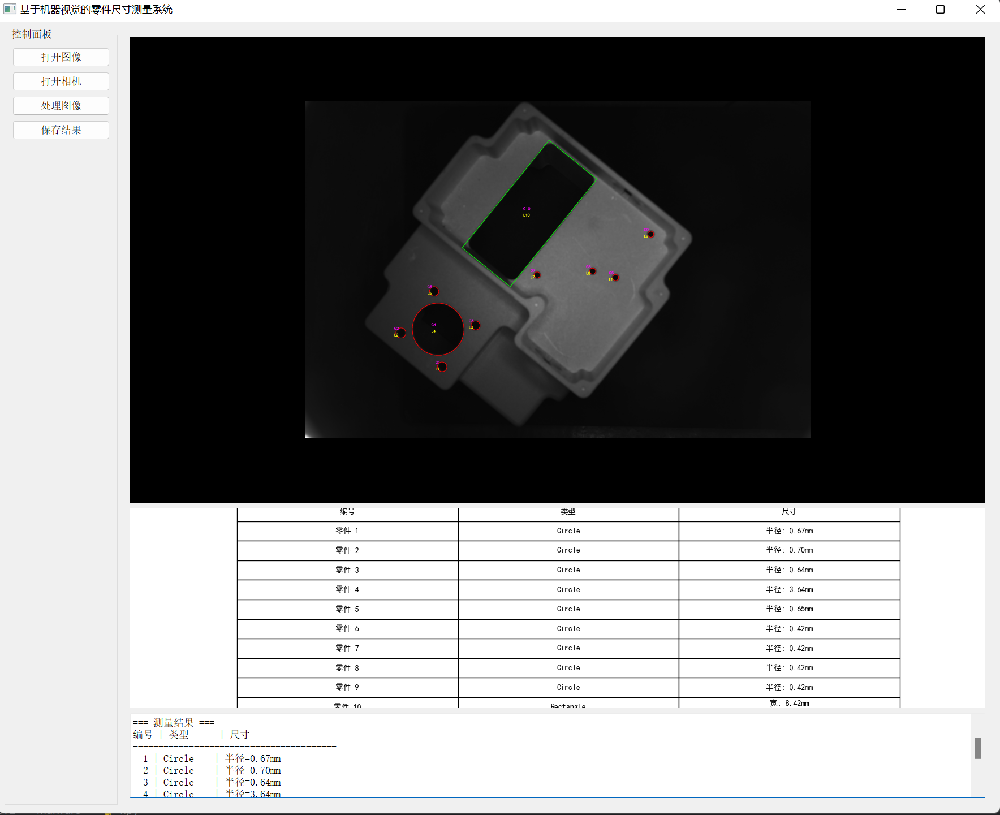

# 这是在基于Qt5 以及边缘检测，圆形/矩形拟合的可视化的检测工件尺寸程序

# Industrial Workpiece Dimension Measurement System



A Qt5-based visualization program for edge detection and geometric shape fitting, designed for precise dimensional measurement of industrial workpieces with camera/image input support.


## Features
- 🎥 **Multi-source input**: USB camera live capture & local image processing
- 🔍 **Precision detection**: 
  - Zernike moment sub-pixel edge detection
  - Hough circle transform + contour approximation
- 📏 **Dimension measurement**:
  - Circle diameter calculation
  - Rectangle width/height measurement
  - Pixel-to-real conversion with calibration
- 🖥️ **Interactive UI**: Real-time visualization pipeline

## System Diagram
```mermaid
graph LR
    A[Input] --> B(Preprocessing)
    B --> C[Edge Detection]
    C --> D{Shape Detection}
    D -->|Circle| E[Hough Transform]
    D -->|Rectangle| F[Contour Analysis]
    E & F --> G[Dimension Calculation]
    G --> H[Visualization]

